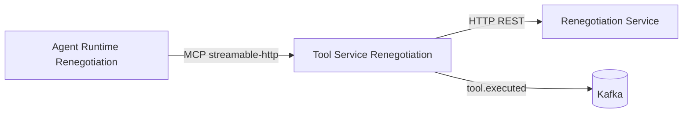

# Tool Service Renegotiation

Serviço MCP responsável por expor ferramentas governadas de renegociação de dívidas para o `agent-runtime-renegotiation`.

Este serviço encapsula chamadas ao serviço core de renegociação, publica eventos de execução de tools no Kafka e evita expor diretamente integrações sensíveis ao agente.

## Visão geral



## Stack

- Python 3.12
- MCP / FastMCP
- HTTPX
- Tenacity
- Confluent Kafka
- Pydantic Settings
- PyJWT (validação do token de entrada e assinatura dos tokens `governed_tool` para o Renegotiation Service)
- Uvicorn
- Pytest

## Responsabilidades

- Expor tools MCP para o runtime do agente — todas exigem um JWT `tool_execution` válido (porta MCP, `8400`) e são autorizadas por uma política de estágio de jornada (ver seção abaixo).
- Encapsular chamadas HTTP ao serviço core de renegociação, assinando um token `governed_tool` por chamada.
- Aplicar retry nas chamadas ao serviço de renegociação.
- Instrumentar toda execução de tool com evento Kafka, incluindo `tenant_id`.
- Não registrar argumentos sensíveis, como CPF e identificadores de contrato, no payload de auditoria.
- Manter o agente desacoplado das APIs internas de renegociação.

## Autorização por estágio de jornada

Além do JWT de entrada (assinado pelo `agent-runtime-renegotiation`, `token_use=tool_execution`), cada tool é autorizada por `app/policy.py` de acordo com o `journey_stage` assinado na claim — chamar uma tool fora do estágio permitido é negado (erro na resposta MCP/REST, sem chegar a bater no Renegotiation Service).

| Tool | Estágios permitidos |
|---|---|
| `consultar_cliente` | `Started`, `IdentificationPending`, `AuthenticationPending`, `CustomerIdentified`, `ContractSelectionPending`, `ContractSelected`, `EligibilityChecked`, `SimulationParametersPending`, `ProposalAvailable`, `ProposalSelected`, `ConfirmationPending` |
| `consultar_contratos` | `IdentificationPending`, `CustomerIdentified`, `ContractSelectionPending`, `ContractSelected`, `EligibilityChecked`, `SimulationParametersPending`, `ProposalAvailable`, `ProposalSelected`, `ConfirmationPending` |
| `consultar_debitos` | `ContractSelected`, `EligibilityChecked`, `SimulationParametersPending`, `ProposalAvailable`, `ProposalSelected`, `ConfirmationPending` |
| `validar_elegibilidade` | `ContractSelected`, `EligibilityChecked`, `SimulationParametersPending` |
| `simular_proposta` | `ContractSelected`, `EligibilityChecked`, `SimulationParametersPending` |
| `confirmar_acordo` | `ProposalSelected`, `ConfirmationPending` — exige também evidência de confirmação explícita (`confirmation_message_id` assinado batendo com a mensagem atual) |
| `gerar_documento` | `AgreementConfirmed`, `DocumentAvailable`, `Completed` |

> `consultar_contratos` inclui `IdentificationPending` de propósito: o `journey_stage` é assinado uma única vez no início do turno do agente (não a cada chamada de tool), então o encadeamento natural "identificar cliente → listar contratos" no mesmo turno precisa que ambas as tools sejam permitidas a partir do estágio anterior à identificação.

`simular_proposta` e `confirmar_acordo` também derivam uma `Idempotency-Key` determinística a partir do contexto assinado (tenant, conversa, mensagem, versão da jornada, argumentos), usada na chamada ao Renegotiation Service.

## Tools MCP

O serviço registra 7 tools MCP governadas.

| Tool | Entrada | Descrição | Endpoint chamado |
|---|---|---|---|
| `consultar_cliente` | `cpf: str` | Consulta dados cadastrais do cliente pelo CPF. | `GET /clients/{cpf}` |
| `consultar_contratos` | `client_id: str` | Consulta contratos de um cliente. | `GET /clients/{client_id}/contracts` |
| `consultar_debitos` | `contract_id: str` | Consulta débitos em aberto de um contrato. | `GET /contracts/{contract_id}/debts` |
| `validar_elegibilidade` | `contract_id: str` | Valida elegibilidade de um contrato para renegociação. | `GET /contracts/{contract_id}/eligibility` |
| `simular_proposta` | `contract_id: str`, `installments: int`, `discount_percentage: float = 0.0` | Simula proposta de renegociação. | `POST /contracts/{contract_id}/simulations` |
| `confirmar_acordo` | `simulation_id: str` | Confirma e formaliza acordo a partir de uma simulação. | `POST /simulations/{simulation_id}/confirmations` |
| `gerar_documento` | `agreement_id: str` | Gera documento ou comprovante de acordo formalizado. | `GET /agreements/{agreement_id}/document` |

## Contratos de exemplo

### `consultar_cliente`

```json
{
  "cpf": "12345678900"
}
```

### `consultar_contratos`

```json
{
  "client_id": "client-001"
}
```

### `consultar_debitos`

```json
{
  "contract_id": "contract-001"
}
```

### `validar_elegibilidade`

```json
{
  "contract_id": "contract-001"
}
```

### `simular_proposta`

```json
{
  "contract_id": "contract-001",
  "installments": 12,
  "discount_percentage": 15.0
}
```

### `confirmar_acordo`

```json
{
  "simulation_id": "simulation-001"
}
```

### `gerar_documento`

```json
{
  "agreement_id": "agreement-001"
}
```

## Evento Kafka

Toda execução de tool publica um evento no tópico configurado.

### Tópico: `tool.executed`

```json
{
  "tenant_id": "00000000-0000-0000-0000-000000000001",
  "tool_name": "consultar_cliente",
  "outcome": "success",
  "correlation_id": "b4f4d4c2f7d94ef0a8e4d8d6f7c2a123"
}
```

### Observações

- `outcome` pode ser `success` ou `error`.
- O evento é publicado tanto em sucesso quanto em falha.
- O payload não inclui argumentos da tool para evitar vazamento de CPF, contratos ou identificadores sensíveis.
- Falhas na publicação Kafka são registradas em log, mas não interrompem a execução da tool.

## Configuração

O serviço usa `pydantic-settings` com variáveis de ambiente.

| Variável | Default | Descrição |
|---|---:|---|
| `MCP_HOST` | `0.0.0.0` | Host onde o servidor MCP será exposto. |
| `MCP_PORT` | `8400` | Porta do servidor MCP. |
| `DOCS_PORT` | `8401` | Porta da fachada REST/Swagger somente para documentação (ver seção abaixo). |
| `RENEGOTIATION_SERVICE_BASE_URL` | `http://localhost:9400` | Base URL do serviço core de renegociação. |
| `RENEGOTIATION_SERVICE_RETRY_ATTEMPTS` | `2` | Tentativas adicionais em chamadas ao serviço de renegociação. |
| `KAFKA_BOOTSTRAP_SERVERS` | `localhost:29092` | Bootstrap servers do Kafka. |
| `KAFKA_TOOL_EVENTS_TOPIC` | `tool.executed` | Tópico de eventos de execução de tools. |
| `RENEGOTIATION_SERVICE_AUDIENCE` | `renegotiation-service` | Audiência assinada no token enviado ao Renegotiation Service. |
| `INTERNAL_AUTH_ENABLED` | `true` | Se `false`, as tools MCP não exigem JWT de entrada (uso local/teste). |
| `INTERNAL_AUTH_SIGNING_KEY` | (vazio) | Chave HS256 usada para validar o token de entrada (`agent-runtime-renegotiation`) e assinar o token `governed_tool` enviado ao Renegotiation Service. Obrigatória com auth habilitada. |

Exemplo:

```bash
export MCP_HOST="0.0.0.0"
export MCP_PORT="8400"
export RENEGOTIATION_SERVICE_BASE_URL="http://localhost:9400"
export KAFKA_BOOTSTRAP_SERVERS="localhost:29092"
export KAFKA_TOOL_EVENTS_TOPIC="tool.executed"
export INTERNAL_AUTH_SIGNING_KEY="<segredo-com-pelo-menos-32-bytes>"
```

## Como executar localmente

### Pré-requisitos

- Python 3.12
- Kafka local em `localhost:29092`
- Serviço core de renegociação disponível em `localhost:9400`
- Cliente MCP, como o `agent-runtime-renegotiation`, apontando para `http://localhost:8400/mcp`
- `INTERNAL_AUTH_SIGNING_KEY` com pelo menos 32 bytes, igual ao configurado no `agent-runtime-renegotiation` e no `renegotiation-service`

### Criar ambiente virtual

```bash
python -m venv .venv
```

Ativar no Windows:

```bash
.venv\Scripts\activate
```

Ativar no Linux/macOS:

```bash
source .venv/bin/activate
```

### Instalar dependências

```bash
pip install -r requirements.txt
```

Para desenvolvimento e testes:

```bash
pip install -r requirements-dev.txt
```

### Subir servidor MCP

```bash
python -m app.main
```

O servidor sobe em:

```text
http://localhost:8400/mcp
```

O mesmo processo também sobe, na porta `DOCS_PORT` (default `8401`), uma **fachada REST somente para documentação** (`app/rest_api.py`) espelhando as mesmas 7 tools via Swagger UI:

```text
http://localhost:8401/docs
```

MCP não tem uma superfície OpenAPI própria — é um protocolo JSON-RPC-like sobre streamable-HTTP, não REST. Essa fachada existe só para permitir explorar/testar as tools com uma UI; nenhum cliente do workspace a consome (`agent-runtime-renegotiation` fala MCP em `:8400/mcp`, não REST).

`GET /health/live` e `GET /health/ready` também são expostos na porta REST (`:8401`), não na porta MCP — `/health/ready` verifica a chave de assinatura, o Kafka e o Renegotiation Service.

## Testes

```bash
python -m pytest
```

> Use `python -m pytest`, não o script `pytest` isolado — sem o `python -m`, o diretório do projeto não entra no `sys.path` e a suíte inteira falha com `ModuleNotFoundError: No module named 'app'` (é exatamente por isso que o workflow de CI usa `python -m pytest`).

O `pyproject.toml` aponta os testes para a pasta `tests` e usa `asyncio_mode = auto`.

## CI

`.github/workflows/ci.yml` roda `pip install`/`python -m pytest` a cada push/PR para `master`. `confluent-kafka` tem wheel pronta para `manylinux_2_28_x86_64`/cp312, então não precisa de pacotes de sistema extras no runner.

## Estrutura

```text
.
├── app
│   ├── events
│   │   ├── instrumentation.py
│   │   └── publisher.py
│   ├── config.py
│   ├── logging_setup.py
│   ├── main.py
│   ├── mcp_server.py
│   ├── platform.py
│   ├── policy.py
│   ├── renegotiation_client.py
│   └── rest_api.py
├── tests
│   ├── test_mcp_server_integration.py
│   ├── test_policy.py
│   ├── test_publisher.py
│   ├── test_renegotiation_client.py
│   ├── test_rest_api.py
│   └── test_tools.py
├── requirements.txt
├── requirements-dev.txt
├── pyproject.toml
├── Dockerfile
├── .github/workflows/ci.yml
└── tool-service-renegotiation.pyproj
```

## Integrações

### Agent Runtime Renegotiation

Consome as tools expostas via MCP em `http://localhost:8400/mcp`.

### Renegotiation Service

Serviço HTTP core que fornece dados de cliente, contratos, débitos, elegibilidade, simulações, confirmações e documentos.

### Kafka

Recebe eventos `tool.executed` para observabilidade e auditoria de execução das tools.

## Resiliência e segurança

- Toda tool exige um JWT `tool_execution` válido de entrada, e cada chamada ao Renegotiation Service é assinada com um token `governed_tool` próprio (ver "Autorização por estágio de jornada" acima).
- Chamadas ao serviço core usam retry com espera fixa curta.
- Quando as tentativas esgotam, o client lança `RenegotiationServiceUnavailableError`.
- Logs evitam imprimir URLs de erro, pois podem conter CPF ou identificadores sensíveis.
- Eventos Kafka não carregam argumentos das tools.
- Cada execução recebe um `correlation_id` gerado internamente.

## Próximos passos sugeridos

- Documentar contrato do serviço core de renegociação.
- Criar mocks locais para os endpoints `/clients`, `/contracts`, `/simulations` e `/agreements`.
- Análise estática no CI (hoje o workflow só roda a suíte de testes).
